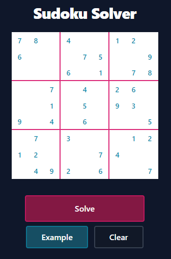

# Sudoku Solver

A quick little UI for solving a `9x9` standard Sudoku, using the following frameworks:

-  React
-  NextJs
-  Vercel
-  Tailwind

  

[Demo](https://sudoku-solver-matt-d-webb.vercel.app)

